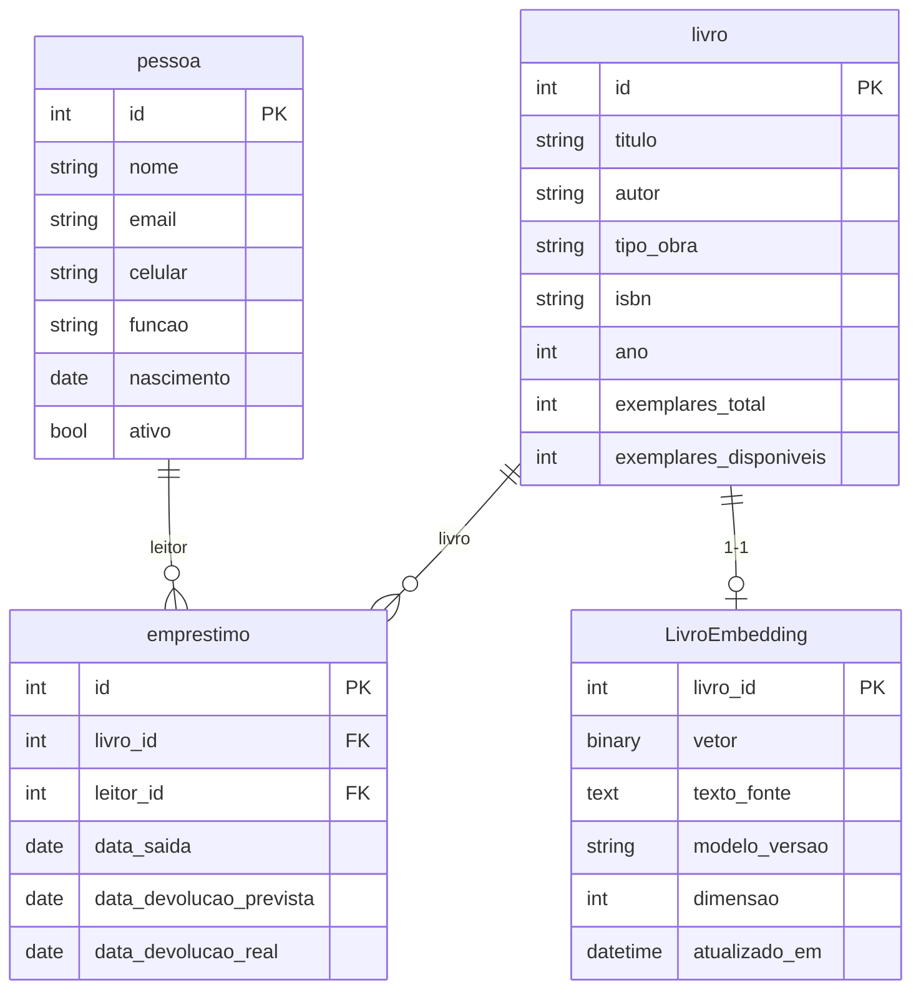
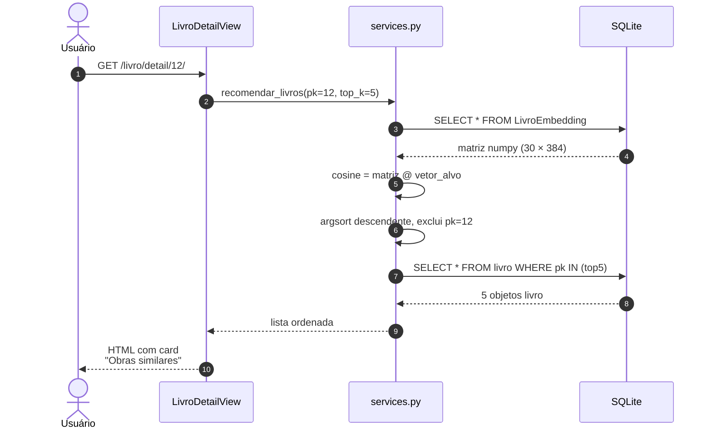
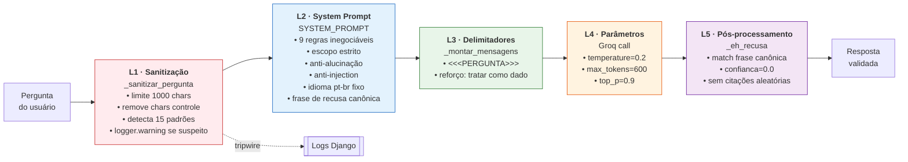

# MVP Features — Inventário técnico

> **Fonte:** auditoria de código realizada em 2026-04-21 pelo agente `codebase-explorer`, cruzada com a proposta aprovada (`proposta/proposta.md` §4.2).
>
> Este documento detalha **o que existe no código** no momento da auditoria. É o catálogo técnico do MVP — não uma lista de desejos.

---

## 1. Modelo de dados



**Notas sobre os campos (não vão no diagrama para evitar bugs do parser Mermaid):**

- `pessoa.funcao` — valores aceitos: `Leitor` ou `Bibliotecario`
- `pessoa.nascimento` — opcional
- `livro.tipo_obra` — valores: `BIBLIOGRAFIA`, `TESE_DISSERTACAO`, `MONOGRAFIA`
- `livro.isbn`, `livro.ano` — opcionais
- `emprestimo.data_saida` — preenchida via `auto_now_add`
- `emprestimo.data_devolucao_prevista` — `data_saida + 14 dias` (automático)
- `emprestimo.data_devolucao_real` — `null` enquanto não devolvido
- `LivroEmbedding.livro_id` — PK e também FK implícito (`OneToOne` com `livro`)
- `LivroEmbedding.vetor` — `float32`, 384 dimensões (`BinaryField`)
- `LivroEmbedding.texto_fonte` — concatenação de título, autor e tipo legível

---

## 2. Inventário por área

### 2.1 CRUD

| Entidade | Model | CBVs | URLs | Templates |
|---|---|---|---|---|
| `pessoa` | [core/models.py:13](../core/models.py#L13) | list, menu, create, update, delete | `core/urls.py:11-15` | pessoa_form, pessoa_menu, pessoa_delete |
| `livro` | [core/models.py:37](../core/models.py#L37) | list, menu, create, update, delete, **detail** | `core/urls.py:17-22` | livro_form, livro_menu, livro_delete, livro_detail |
| `emprestimo` | [core/models.py:70](../core/models.py#L70) | list, menu, create, update, delete | `core/urls.py:24-28` | emprestimo_form, emprestimo_menu, emprestimo_delete |

**Totais:** 15 CBVs + 5 FBVs (`index`, `logout_view`, `menu`, `atrasados`, `chat`) = **20 views**.

### 2.2 Regras de negócio

| Regra | Arquivo:linha | Comportamento |
|---|---|---|
| `exemplares_disponiveis ≤ exemplares_total` | [core/models.py:51-57](../core/models.py#L51) | `livro.clean()` — `ValidationError` |
| Bibliografia exige ISBN | [core/models.py:51-57](../core/models.py#L51) | `livro.clean()` — `ValidationError` |
| Empréstimo decrementa estoque | [core/models.py:88-107](../core/models.py#L88) | `emprestimo.save()` ao criar |
| Data de devolução automática | [core/models.py:88-107](../core/models.py#L88) | `saida + timedelta(days=14)` |
| Livro esgotado barra novo empréstimo | [core/models.py:88-107](../core/models.py#L88) | `ValidationError` se `exemplares_disponiveis = 0` |
| Leitor inativo barra novo empréstimo | [core/models.py:88-107](../core/models.py#L88) | `ValidationError` se `leitor.ativo = False` |
| Devolução devolve exemplar ao estoque | [core/models.py:88-107](../core/models.py#L88) | `emprestimo.save()` detecta transição `data_devolucao_real` null → preenchida |
| Status dinâmico | [core/models.py:109-119](../core/models.py#L109) | `property` retorna `EMPRESTADO / DEVOLVIDO / ATRASADO` |

### 2.3 Autenticação e autorização

- **Login/logout:** [core/views.py:16-27](../core/views.py#L16)
- `LOGIN_URL = '/'` e `LOGIN_REDIRECT_URL = '/menu/'` em [biblioteca_mvp/settings.py:87-88](../biblioteca_mvp/settings.py#L87)
- `@login_required` em views funcionais; `LoginRequiredMixin` em todas as CBVs
- **Grupos criados pelo seed:**
  - `Visualizador` → permissões `view_*` de `core` (leitor)
  - `Editor` → todas as permissões de `core` exceto `delete_*` (bibliotecário)
- Superusuário `admin` criado automaticamente

### 2.4 UI

- **Template base:** `core/templates/core/base.html` — Bootstrap 5 via `django-bootstrap-v5`, navbar `bg-success`, condicional ``
- **Breadcrumbs:** presentes em `livro_detail.html` e `chat.html`
- **Badges coloridas:**
  - Tipo de obra: `Bibliografia` (primary), `Tese/Dissert.` (warning), `Monografia` (info)
  - Status de empréstimo: `EMPRESTADO` (primary), `DEVOLVIDO` (success), `ATRASADO` (danger)
- **Paginação:** 10 itens/página em todas as listagens via `SingleTableView`
- **Responsividade:** grid Bootstrap 5 `col-md-*`

### 2.5 Dashboard

Métricas em cards coloridos (`core/views.py:32-44` → `core/templates/core/menu.html`):

| Card | Variável | Cor |
|---|---|---|
| Obras no acervo | `total_livros` | verde |
| Leitores ativos | `total_leitores` | info |
| Empréstimos ativos | `emprestimos_ativos` | azul |
| Empréstimos atrasados | `emprestimos_atrasados` | vermelho |
| Bibliografias | `bibliografias` | borda azul |
| Teses/dissertações | `teses` | borda amarela |
| Monografias | `monografias` | borda info |

### 2.6 IA Fase 1 — Recomendação semântica

Fluxo completo da requisição:



**Componentes:**

| Item | Arquivo | Função |
|---|---|---|
| Modelo ML | [recomendador/embeddings.py:34](../recomendador/embeddings.py#L34) | `paraphrase-multilingual-MiniLM-L12-v2` (lazy-load, 384 dim) |
| Mock determinístico | [recomendador/embeddings.py:42-47](../recomendador/embeddings.py#L42) | hash MD5 → numpy random seeded (CI/sem rede) |
| Texto fonte | [recomendador/embeddings.py:49-61](../recomendador/embeddings.py#L49) | `titulo \| autor \| tipo_legivel` |
| Persistência | [recomendador/models.py:7-36](../recomendador/models.py#L7) | `LivroEmbedding` (OneToOne, BinaryField) |
| Busca | [recomendador/services.py:39-58](../recomendador/services.py#L39) | `recomendar_livros(pk, top_k=5)` |
| Busca por leitor | [recomendador/services.py:90-124](../recomendador/services.py#L90) | `recomendar_para_leitor(leitor_id, top_k=5)` (média do histórico) |
| Regeneração | [recomendador/signals.py:15-44](../recomendador/signals.py#L15) | `post_save(livro)` |
| Bootstrap | [recomendador/management/commands/gerar_embeddings.py](../recomendador/management/commands/gerar_embeddings.py) | `--force`, `--mock` |
| Integração UI | [core/views.py:109-123](../core/views.py#L109) | `livro_detail.get_context_data` → top-5 no card lateral |

**Performance medida** (30 obras, CPU Mac, benchmark em 2026-04-20):
- `recomendar_livros`: p50 = **0.47 ms**, p95 = 0.72 ms, max = 1.46 ms (50 runs)
- Bootstrap completo: **~1 s** (modelo cacheado)
- Tamanho do modelo: ~420 MB em `~/.cache/huggingface/`

### 2.7 IA Fase 2 — Chat RAG

Fluxo completo:

```mermaid
sequenceDiagram
    autonumber
    actor U as Usuário
    participant V as core/views.py:chat
    participant I as chat/interface.py
    participant R as chat/rag.py
    participant E as embeddings.py
    participant DB as SQLite
    participant G as Groq API

    U->>V: POST /chat/ pergunta
    V->>I: responder_pergunta(pergunta)
    I->>R: responder(pergunta)

    rect rgb(255, 240, 240)
        note over R: Camada de sanitização (L1)
        R->>R: _sanitizar_pergunta()<br/>trunca + detecta padrões
    end

    rect rgb(240, 248, 255)
        note over R,DB: Retrieval híbrido
        R->>E: gerar_embedding(pergunta)
        E-->>R: vetor 384d
        R->>DB: SELECT todos LivroEmbedding
        DB-->>R: matriz + ids
        R->>R: ranqueia acervo (≤200: tudo; >200: top-30)
    end

    rect rgb(240, 255, 240)
        note over R,G: Inferência com guardrails
        R->>R: _montar_mensagens<br/>(SYSTEM_PROMPT + <<<PERGUNTA>>>)
        R->>G: chat.completions.create<br/>temp=0.2
        G-->>R: resposta com (Obra #N)
    end

    rect rgb(255, 240, 255)
        note over R: Pós-processamento (L5)
        R->>R: _extrair_ids_citados (regex)
        R->>R: _eh_recusa? → confianca=0.0
    end

    R-->>I: RespostaChat
    I-->>V: RespostaChat
    V->>DB: SELECT obras citadas
    V-->>U: HTML com resposta + cards
```

**Componentes:**

| Item | Arquivo | Descrição |
|---|---|---|
| Contrato público | [recomendador/chat/interface.py](../recomendador/chat/interface.py) | `RespostaChat` + `responder_pergunta` |
| Pipeline RAG | [recomendador/chat/rag.py](../recomendador/chat/rag.py) | implementação completa |
| Retrieval híbrido | [rag.py:108-167](../recomendador/chat/rag.py#L108) | acervo completo se ≤200, senão top-30 |
| Formato de contexto | [rag.py:170-199](../recomendador/chat/rag.py#L170) | título, autor, tipo, ano, ISBN, exemplares |
| Extração de citações | [rag.py:332-341](../recomendador/chat/rag.py#L332) | regex `\(Obra\s*#(\d+)\)` |
| View HTTP | [core/views.py:54-77](../core/views.py#L54) | chat form + render |
| Template | [core/templates/core/chat.html](../core/templates/core/chat.html) | input + resposta + obras citadas |

**Modelo e parâmetros:**
- `llama-3.3-70b-versatile` via Groq API
- `temperature=0.2`, `max_tokens=600`, `top_p=0.9`
- Variáveis em `.env`: `GROQ_API_KEY`, `GROQ_MODEL`
- Cliente singleton lazy-load ([rag.py:31-46](../recomendador/chat/rag.py#L31))

### 2.8 Segurança — defense-in-depth



**7 cenários adversariais validados manualmente** (ver `docs/seguranca_chat.md` §4 para script):
off-topic (política), injection clássica, jailbreak de persona, troca de idioma, revelação de sistema, tema sensível médico, tema sensível jurídico → **7/7 recusados** com frase canônica e `confianca=0.0`.

### 2.9 Testes automatizados

| Arquivo | Testes | Cobre |
|---|---|---|
| [recomendador/tests/test_services.py](../recomendador/tests/test_services.py) | 9 | `build_text_for_embedding`, `gerar_embedding` (dtype/determinismo), `recomendar_livros` (top-k, exclusão próprio, ids distintos, sem embedding), `recomendar_para_leitor` (com/sem histórico) |
| `core/tests.py` | 0 | stub vazio |

Execução: `python manage.py test recomendador` — 9 tests em ~32ms usando `@override_settings(RECOMENDADOR_MOCK=True)` (sem rede).

**Gaps de testes:**
- Regras do `save()` e `clean()` de `emprestimo` e `livro` (model tests)
- Login, chat, atrasados (view tests)
- Pipeline RAG (`_sanitizar_pergunta`, `_eh_recusa`, `_extrair_ids_citados`)
- 7 cenários adversariais como suite automatizada

### 2.10 Seed / dados de exemplo

`seed.py` — idempotente, cria:

| Entidade | Quantidade |
|---|---|
| superuser `admin/admin123` | 1 |
| grupos com permissões | 2 (Visualizador, Editor) |
| usuários de teste | 2 (`biblio1`, `leitor1`) |
| `pessoa` | 4 (1 Bibliotecario + 3 Leitores) |
| `livro` | 30 (22 bibliografias + 5 teses + 3 monografias) |
| `emprestimo` | 3 (ativo, devolvido, atrasado 30 dias) |

---

## 3. Gap analysis — proposta vs. implementação

| Promessa (`proposta.md` §4.2) | Status | Evidência |
|---|---|---|
| Modelo `paraphrase-multilingual-MiniLM-L12-v2` via sentence-transformers | ✅ | `embeddings.py:34`, `settings.py:28` |
| Signal `post_save` regera embedding | ✅ | `signals.py:15-44` |
| Vetor 384d em `BinaryField`, `OneToOne` com livro | ✅ | `models.py:7-36` |
| Similaridade cosseno, top-5, <1ms para ~30 obras | ✅ | `services.py:39-58`; benchmark p50 = 0.47ms |
| `recomendar_para_leitor` (média de vetores do histórico) | ✅ | `services.py:90-124` |
| RAG via Groq `llama-3.3-70b-versatile` | ✅ | `rag.py:386` |
| Pergunta vetorizada pelo mesmo MiniLM da Fase 1 | ✅ | `rag.py:115` |
| Estratégia híbrida: acervo completo ≤200 / top-30 >200 | ✅ | `rag.py:108-167` |
| Contexto com título, autor, tipo, ano, ISBN, exemplares | ✅ | `rag.py:170-199` |
| Resposta em pt-br com citações `(Obra #N)` rastreáveis | ✅ | `SYSTEM_PROMPT` regra 9 |
| Interface exibe obras citadas com links | ✅ | `chat.html:54-84` |
| Defense-in-depth com 5 camadas | ✅ | `rag.py` L1-L5 documentados |
| 7 testes adversariais | 🟡 | Executados manualmente, sem script automatizado |
| ADR-002 para Groq (Sprint 2) | ❌ | Apenas ADR-001 existe |
| ADR-001 em status APROVADO com benchmark | 🟡 | Status DRAFT; benchmark T2 ainda não rodado pelo Givanildo em máquina própria |
| Logging persistente de perguntas para auditoria | ❌ | `logger.warning` existe, mas sem persistência em banco (previsto Sprint 3) |
| Rate limiting no Django | ❌ | Previsto Sprint 3 |
| Histórico de conversa no chat | ❌ | Parâmetro `historico` aceito em `interface.py:26` mas ignorado em `rag.py` |

---

## 4. Pontos frágeis conhecidos (em produção)

| Ponto | Arquivo | Risco | Mitigação sugerida |
|---|---|---|---|
| `emprestimo.save()` sem `transaction.atomic()` | [core/models.py:88-107](../core/models.py#L88) | Falha entre decremento de estoque e `super().save()` corrompe contador | Envolver em `with transaction.atomic():` |
| `SECRET_KEY` hardcoded | [settings.py:11](../biblioteca_mvp/settings.py#L11) | Comprometimento se repo vazar | Mover para `.env` |
| `DEBUG=True` hardcoded | [settings.py:12](../biblioteca_mvp/settings.py#L12) | Exposição de stack traces em prod | `os.getenv('DJANGO_DEBUG', 'False').lower() == 'true'` |
| `ALLOWED_HOSTS=['*']` | [settings.py:13](../biblioteca_mvp/settings.py#L13) | Host header attacks | Lista específica por ambiente |
| Modelo ML carregado por worker | [embeddings.py:13](../recomendador/embeddings.py#L13) | Pico de memória (~450MB × N workers) | Pré-carregar no startup ou usar `preload_app` do gunicorn |
| `carregar_acervo_para_contexto` sem cache | [rag.py:132](../recomendador/chat/rag.py#L132) | Query de todos os embeddings a cada pergunta | Cache em memória com invalidação via signal |
| Duplicação de renderização de badges | tables.py + livro_detail.html + chat.html | Manutenção inconsistente | Template tag ou método no modelo |

---

## 5. Como reproduzir a auditoria

```bash
# 1. Instalar stack
cd biblioteca_mvp
source ../framework/BigData-T2-env/bin/activate
pip install -r requirements.txt

# 2. Migrar e popular
python manage.py migrate
python manage.py shell < seed.py
python manage.py gerar_embeddings --force

# 3. Rodar testes automatizados
python manage.py test recomendador -v 2

# 4. Rodar testes adversariais do chat (ver docs/seguranca_chat.md §7)
# (Requer GROQ_API_KEY no .env)

# 5. Medir latência da recomendação
python -c "
import django, os, time, statistics
os.environ['DJANGO_SETTINGS_MODULE'] = 'biblioteca_mvp.settings'
django.setup()
from recomendador.services import recomendar_livros
recomendar_livros(1)  # warmup
tempos = [(time.perf_counter(), recomendar_livros(1), time.perf_counter())[0:3:2] for _ in range(50)]
t = [(b-a)*1000 for a,b in tempos]
print(f'p50: {statistics.median(t):.2f}ms  p95: {sorted(t)[47]:.2f}ms  max: {max(t):.2f}ms')
"

# 6. Abrir UI
python manage.py runserver
# http://localhost:8000 — biblio1/biblio123
```
