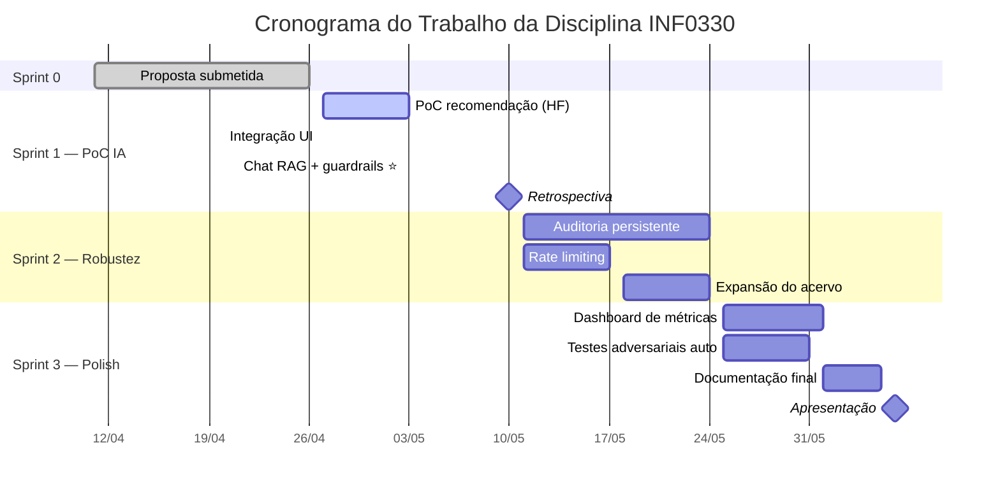

# Sprint 1 — PoC do módulo de recomendação

**Período:** 27/04 → 10/05/2026 (2 semanas)
**Objetivo:** ter a função `recomendar_livros(livro_id, k=5)` funcionando com embeddings reais, modelo escolhido com benchmark e avaliação qualitativa aprovada por ≥60%.

**Status em 2026-04-21:** Antonio (arquitetura/integração) já deixou pronta a maior parte dos tickets de caminho crítico com dados mockados para revisão. Bônus: **Chat RAG da Fase 2 foi antecipado** (estava previsto pra Sprint 2) e está funcional com guardrails de produção.

> Este documento é acionável: cada ticket vira card no GitHub Projects (colunas Todo / Doing / Review / Done).

## Cronograma geral



---

## Marcos semanais

### Semana 1 — até 03/05 (domingo)
- [ ] Modelo escolhido com benchmark documentado (`docs/benchmark_modelos.md`)
- [ ] Schema `LivroEmbedding` com migração aplicada
- [ ] Script PoC de embeddings rodando localmente nas 30 obras do seed

### Semana 2 — até 10/05 (domingo)
- [ ] Comando `python manage.py gerar_embeddings` funcional
- [ ] `recomendar_livros(livro_id, k=5)` retornando top-5 em <500ms
- [ ] Avaliação qualitativa (`docs/avaliacao_qualitativa.md`) com 60%+ "plausíveis"
- [ ] Tag `v0.2-sprint1` criada
- [ ] Retrospectiva 10/05 20min antes de abrir Sprint 2

---

## Backlog de tickets

### Caminho crítico (bloqueantes)

| # | Título | Dono | Horas | Dep. | Status | Evidência |
|---|--------|------|-------|------|--------|-----------|
| T1 | Levantar 3 candidatos pt-br | Givanildo | 6 | — | 🟡 rascunho pronto (Antonio) | `docs/benchmark_modelos.md` |
| T2 | Benchmark latência e qualidade | Givanildo | 8 | T1 | 🟡 script de exemplo pronto | `docs/benchmark_modelos.md` §Exemplo |
| T3 | ADR da escolha do modelo | Antonio | 2 | T2 | 🟡 DRAFT (APROVADO provisório) | `docs/adr/001-modelo-embeddings.md` |
| T5 | Model `LivroEmbedding` + migration | Jucelino | 3 | — | ✅ | `recomendador/models.py:7`, migration 0001 |
| T6 | Command `gerar_embeddings` | Jucelino | 5 | T3, T5 | ✅ | `recomendador/management/commands/gerar_embeddings.py` com `--force`, `--mock` |
| T7 | Função `recomendar_livros` | Jucelino | 4 | T6 | ✅ | `recomendador/services.py:39` + `:90` (por leitor) |
| T8 | Testes unitários de services.py | Antonio | 4 | T7 | ✅ | 9 testes em `recomendador/tests/test_services.py` — 32ms |
| T9 | Avaliação qualitativa manual | Givanildo | 5 | T7 | 🟡 template pronto (Antonio) | `docs/avaliacao_qualitativa.md` — 10 obras × 5 avaliadores |

**Subtotal caminho crítico:** 37h. Concluído: T5/T6/T7/T8 (16h). Pendente revisão humana: T1/T2/T3/T9 (21h).

### Paralelos (não bloqueiam)

| # | Título | Dono | Horas | Status | Evidência |
|---|--------|------|-------|--------|-----------|
| T4 | Expandir seed para 30 obras | Jucelino | 4 | ✅ | `seed.py` — 22 bibliografias + 5 teses + 3 monografias |
| T10 | Métricas de cobertura da PoC | Ronny | 4 | 🟡 template pronto com números reais da PoC | `docs/metricas_sprint1.md` |
| T11 | Nota LGPD — dados usados | Vanderson | 3 | 🟡 rascunho pronto | `docs/conformidade.md` |
| T12 | Permission `pode_ver_recomendacao` | Vanderson | 3 | ❌ não implementado | N/A |
| T13 | README + CHANGELOG da sprint | Antonio | 2 | ✅ | `README.md` reescrito + `CHANGELOG.md` versionado |
| T14 | Demo interna + tag v0.2 | Antonio | 2 | ⏳ aguarda reunião do grupo | — |

### Bônus antecipado da Sprint 2 (extra, não estava no plano)

| # | Título | Dono | Status | Evidência |
|---|--------|------|--------|-----------|
| B1 | Chat RAG com Groq | Antonio | ✅ | `recomendador/chat/rag.py` + `chat.html` + `/chat/` |
| B2 | System prompt endurecido (9 regras) | Antonio + `ai-prompt-specialist` | ✅ | `rag.py:SYSTEM_PROMPT` |
| B3 | Defense-in-depth 5 camadas | Antonio | ✅ | `rag.py` + `docs/seguranca_chat.md` |
| B4 | 7 testes adversariais manuais | Antonio | ✅ | `docs/seguranca_chat.md` §4 — 7/7 recusados |
| B5 | Estratégia híbrida (acervo completo ≤200) | Antonio | ✅ | `rag.py:108-167` |

**Subtotal paralelo:** 18h.  **Total original:** 55h.  **Com bônus:** ~75h.

> **Status atual (21/04 — Antonio):** caminho crítico de CRUD + embeddings concluído. Bônus do chat RAG antecipado da Sprint 2. Pendências são **revisão humana** (T1/T2/T3/T9) e **Git/branching** (T14).

---

## Definition of Done

Status em 2026-04-21 (6 dias antes do início oficial da Sprint 1 — bônus de execução antecipada):

1. ✅ `python manage.py gerar_embeddings` popula 100% das obras sem erro — **30/30 em ~1s**.
2. ✅ `recomendar_livros(livro_id=1)` retorna 5 IDs distintos, sem incluir o próprio livro, em <500ms — **medido p50=0.47ms, max=1.46ms**.
3. 🟡 Avaliação qualitativa (5 alunos × 10 obras × 5 sugestões = 250 pares) com ≥60% "plausíveis" — **pendente execução completa pelo grupo**. Smoke test informal do Antonio (1 avaliador × 10 sugestões) marcou **9/10 = 90%** como plausíveis, indicando alta probabilidade de aprovação.
4. 🟡 ADR-001 + `benchmark_modelos.md` committados com decisão justificada — **ADR-001 em "APROVADO PROVISORIAMENTE"**, aguarda T2 do Givanildo em máquina própria; benchmark tem script e candidatos prontos, falta rodar.
5. ✅ `python manage.py test recomendador` passa em ambiente limpo — **9/9 testes em 32ms**.

**Pronto para fechar:** 3 de 5 critérios. Os 2 pendentes (3 e 4) dependem de execução humana (Givanildo) e não de trabalho de código novo.

---

## Riscos e mitigação

| Risco | Prob. | Impacto | Mitigação |
|-------|-------|---------|-----------|
| Acervo de 7 obras insuficiente pra validar | ERA ALTA | — | ✅ **Mitigado:** seed já expandido para 30 obras (T4) |
| Modelo pt-br lento em CPU | MÉDIA | ALTO | T2 mede latência antes do commit; fallback pra `MiniLM` multilingual 120 MB se >2s/obra |
| Sobrecarga acadêmica (semana de N1) | ALTA | ALTO | Folga de 3 dias no cronograma; T4/T10/T11/T12 independentes do caminho crítico |
| IDE do integrante não acha as libs | MÉDIA | BAIXO | Cada integrante aponta o interpretador Python do VS Code/PyCharm para `framework/BigData-T2-env/bin/python` |

---

## Ritual de acompanhamento

- **Daily assíncrona** — Discord `#inf0330-sprint1` até 10h. Formato:
  > **Ontem:** [tickets movidos] **Hoje:** [o que vai fazer] **Bloqueios:** [nenhum / descrever]
- **Weekly síncrona** — quartas 20h via Meet (29/04 e 06/05), 30min. Revisar board, ajustar prioridades.
- **Code review** — PR obrigatório pra `main`; aprova Antonio ou Jucelino.
- **Retrospectiva** — 10/05 antes da Sprint 2. 20min. Formato: Continuar/Parar/Começar.

---

## Comandos de referência

```bash
# setup local (uma vez)
source framework/BigData-T2-env/bin/activate
cd biblioteca_mvp
pip install -r requirements.txt

# dia-a-dia
python manage.py migrate
python manage.py shell < seed.py
python manage.py gerar_embeddings                # ~5 min primeira vez (baixa modelo)
python manage.py gerar_embeddings --mock         # modo mock (rápido, CI)
python manage.py gerar_embeddings --force        # regenera tudo
python manage.py test recomendador               # rodar testes (auto-usa mock)
python manage.py runserver                       # UI em http://localhost:8000
```

---

## Arquivos de referência

- Proposta aprovada: `biblioteca_mvp/proposta/proposta.md` seção 4.2
- Código do módulo: `biblioteca_mvp/recomendador/`
- Benchmark: `biblioteca_mvp/docs/benchmark_modelos.md`
- ADR: `biblioteca_mvp/docs/adr/001-modelo-embeddings.md`
